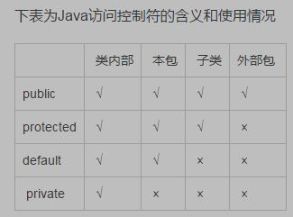

# Java访问控制符

### public、protected、default、private的区别

1、public：

具有最大的访问权限，可以访问任何一个在classpath下的类、接口、异常等。它往往用于对外的情况，也就是对象或类对外的一种接口的形式。

2、protected：

主要的作用就是用来保护子类的。它的含义在于子类可以用它修饰的成员，其他的不可以，它相当于传递给子类的一种继承的东西

3、default：

有时候也称为friendly，它是针对本包访问而设计的，任何处于本包下的类、接口、异常等，都可以相互访问。

4、private：

访问权限仅限于类的内部，是一种封装的体现，例如，大多数成员变量都是修饰符为private的，它们不希望被其他任何外部的类访问。

>注意：java的访问控制是停留在编译层的，也就是它不会在.class文件中留下任何的痕迹，只在编译的时候进行访问控制的检查。
其实，通过反射的手段，是可以访问任何包下任何类中的成员，例如，访问类的私有成员也是可能的。
---

主要区别：

public：可以被所有其他类所访问

private：只能被自己访问和修改

protected：自身、子类及同一个包中类可以访问(如果不同包有继承则子类同样可以访问不同包的父类)

default：同一包中的类可以访问，声明时没有加修饰符，认为是friendly(若父子类在同一个包则可以相互访问，若不在同一个包则不能相互访问)