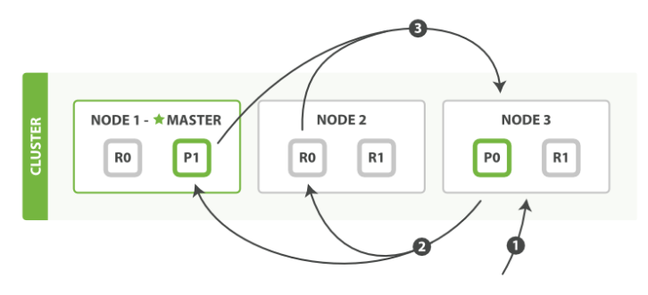

# 快速理解Elasticsearch分片

### 路由计算(routing)
Elasticsearch针对路由计算选择了一个很简单的方法，计算如下：

``` routing
routing = hash(routing) % number_of_primary_shards
```

每个数据都有一个routing参数，默认情况下，就使用其_id值，将其_id值计算hash后，对索引的主分片数取余，就是数据实际应该存储到的分片ID

由于取余这个计算，完全依赖于分母，所以导致Elasticsearch索引有一个限制，索引的主分片数，不可以随意修改。因为一旦主分片数不一样，索引数据不可读。

### shard allocate

通过路由计算可以确定文本所在的分片id，那么分片在集群中的分配策略是如何确定的？

一般来说，某个shard分配在哪个节点上，是由Elasticsearch自动决定的，以下几种情况会触发分配动作：

- 新索引生成。
- 索引的删除
- 新增副本分片
- 节点增减引发的数据均衡


### 副本一致性(replica)


- 客户端请求发送给Node1节点，这里也可以发送给其他节点
- Node1节点用数据的_id计算出数据应该存储在shard0上，通过cluster state信息发现shard0的主分片在Node3节点上，Node1转发请求数据给Node3,Node3完成数据的索引。
- Node3并行转发数据给分配有shard0的副本分片Node1和Node2上。当收到任一节点汇报副本分片数据写入成功以后，Node3即返回给初始的接受节点Node1，宣布数据写入成功。Node1成功返回给客户端。

### 分片的设置

Elasticsearch中, 每个Shard每秒都会自动refresh一次, 所以ES是近实时的, 数据插入到可以被搜索的间隔默认是1秒。若要优化索引速度, 而不注重实时性, 可以手动设置refresh间隔降低刷新频率。当你在生产环境中建立一个大的新索引时, 可以先关闭自动刷新, 要开始使用该索引时再改回来

``` refresh
# 关闭自动刷新: 
PUT employee/_settings
{
    "refresh_interval": -1 
} 
# 开启每秒刷新: 
PUT employee/_settings
{
    "refresh_interval": "1s"
} 
```

每个分片本质上就是一个Lucene索引, 因此会消耗相应的文件句柄, 内存和CPU资源，如果分片分散在不同的节点倒是问题不太. 但当分片开始竞争相同的硬件资源时, 性能便会逐步下降。ES使用词频统计来计算相关性. 当然这些统计也会分配到各个分片上. 如果在大量分片上只维护了很少的数据, 则将导致最终的文档相关性较差。

对大数据集, 我们非常鼓励你在合理范围内为索引多分配些分片，每个分片最好不超过30GB，一个好的方案是根据你的节点数量按照1.5~3倍的原则来创建分片。但当索引拥有较多分片时, 为了组装查询结果, ES必须单独查询每个分片(当然并行的方式)并对结果进行合并。在分片分配上并没有绝对的答案，视情况而定。

推荐设置ES_HEAP_SIZE的值，来这只es进程需要的内存（经验值为系统内存的一半以上），同时设置-p参数来指定pid文件的生成位置，在es关闭的时候会用到。


### Logstash分片设置

不知道你是否有基于日期的索引需求, 并且对索引数据的搜索场景非常少. 也许这些索引量将达到成百上千, 但每个索引的数据量只有1GB甚至更小. 对于这种类似场景, 我建议你只需要为索引分配1个分片.

如果使用ES的默认配置(5个分片), 并且使用Logstash按天生成索引, 那么6个月下来, 你拥有的分片数将达到890个. 再多的话, 你的集群将难以工作--除非你提供了更多(例如15个或更多)的节点.

想一下, 大部分的Logstash用户并不会频繁的进行搜索, 甚至每分钟都不会有一次查询. 所以这种场景, 推荐更为经济使用的设置. 在这种场景下, 搜索性能并不是第一要素, 所以并不需要很多副本. 维护单个副本用于数据冗余已经足够. 不过数据被不断载入到内存的比例相应也会变高.

如果你的索引只需要一个分片, 那么使用Logstash的配置可以在3节点的集群中维持运行6个月. 当然你至少需要使用4GB的内存, 不过建议使用8GB, 因为在多数据云平台中使用8GB内存会有明显的网速以及更少的资源共享.


