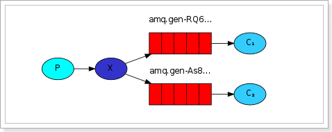
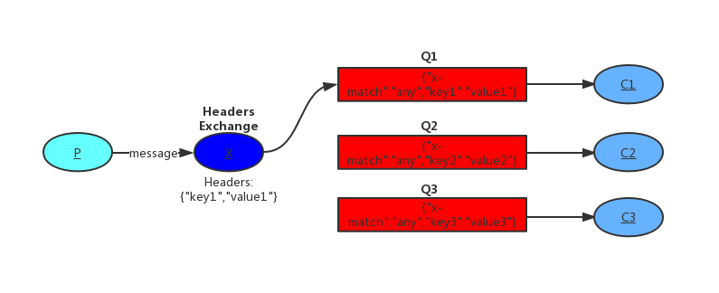
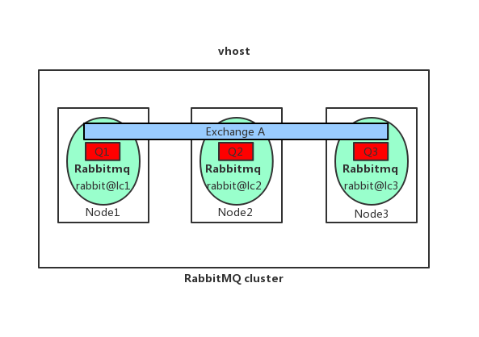
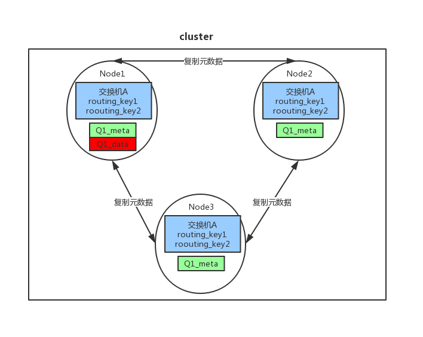

# 消息队列RabbitMQ

## RabbitMQ的四种消息模式

1、Fanout Exchange

2、Direct Exchange

3、Topic Exchange（符号“#”匹配一个或多个词，符号“*”匹配不多不少一个词）

4、Headers

## RabbitMQ消息可靠性保证

- Consumer Acknowledgements
- message persistence
- Publisher Confirms

1、Consumer Acknowledgements

如果一个consumer在运行一个长任务的时候挂掉了或者我们自己kill了一个worker，那么可以看出，发给这个consumer的所有消息将会丢失

>通过Consumer Acknowledgements可以确保发送给consumer的消息不丢失,
此时如果出现上面的第一种情况：channel或者connection断掉，
broker收不到ack就会automatically requeued从而把消息重新分配给其他队列，待到其他队列成功执行后再把消息删除，
这样如果断掉的channel或者connection恢复也不会出现消息重复处理的情况。
---

2、message persistence

Consumer Acknowledgements可以确保发送给consumer的消息不丢失，但是如果RabbitMQ退出或者宕机怎么办呢，消息一样会丢失，
这就需要我们同事对消息和队列做持久化存储，RabbitMQ提供了消息和队列的持久化存储支持，通过MessageProperties.PERSISTENT_TEXT_PLAIN设置实现。

3、Publisher Confirms

将消息和队列持久化并不能完全保证消息完全不丢失，就是RabbitMQ接受消息并且尚未保存消息时，仍然有一个短时间窗口，
还有一种可能就是当消息的发布者在将消息发送出去之后，消息没有到达broker就丢失了。
上面的可靠性保证对于简单的任务队列来说已经足够了，如果需要更强的保证，就需要Publisher Confirms由生成者对发布的消息进行确认。

小结：

>发布确认与消息持久化并不能完全保证消息的可靠性，例如如果消息持久话以后该节点挂掉了，这种情况下如果是单节点的话系统就崩了；
如果事集群的话我的理解是MQ server会根据元信息重新进行requeue，同时认为挂掉的节点消息丢失需要重发，如果此时挂掉的节点重启了，那在做数据同步的时候就会有重复消息。
这种情况我也没有太搞明白，但是我认为做为一个消息中间件，首先要保证的是消息的可用性与可靠性，然后就是保证消息的最终一致性，
这个最终一致性的保证要么是在MQ server这边做去重，要么是在业务端做去重，具体的如何实现待学习。
---

## RabbitMQ集群

RabbitMQ天然支持Clustering。这使得RabbitMQ本身不需要像ActiveMQ、Kafka那样通过ZooKeeper分别来实现HA方案和保存集群的元数据

1、RabbitMQ集群元数据的同步

RabbitMQ集群会始终同步四种类型的内部元数据（类似索引）： 

- a.队列元数据：队列名称和它的属性； 
- b.交换器元数据：交换器名称、类型和属性； 
- c.绑定元数据：一张简单的表格展示了如何将消息路由到队列； 
- d.vhost元数据

>RabbitMQ集群中的所有Queue的完整数据为什么不在所有节点上都保存一份（可以类似MySQL的主主模式嘛），这样任何一个节点出现故障或者宕机不可用时，使用者的客户端只要能连接至其他节点能够照常完成消息的发布和订阅。
RabbitMQ这么设计主要还是基于集群本身的性能和存储空间上来考虑。
第一，存储空间，如果每个集群节点都拥有所有Queue的完全数据拷贝，那么每个节点的存储空间会非常大，集群的消息积压能力会非常弱（无法通过集群节点的扩容提高消息积压能力）；
第二，性能，消息的发布者需要将消息复制到每一个集群节点，对于持久化消息，网络和磁盘同步复制的开销都会明显增加
---

2、RabbitMQ集群发送/订阅消息的基本原理

场景1：客户端直接连接队列所在节点

>如果有一个消息生产者或者消息消费者通过amqp-client的客户端连接至节点1进行消息的发布或者订阅，那么此时的集群中的消息收发只与节点1相关，这个没有任何问题；
如果客户端相连的是节点2或者节点3（队列1数据不在该节点上），那么情况又会是怎么样呢？
---

场景2：客户端连接的是非队列数据所在节点

>如果消息生产者所连接的是节点2或者节点3，此时队列1的完整数据不在该两个节点上，那么在发送消息过程中这两个节点主要起了一个路由转发作用，
根据这两个节点上的元数据（也就是上文提到的：指向queue的owner node的指针）转发至节点1上，最终发送的消息还是会存储至节点1的队列1上。 
同样，如果消息消费者所连接的节点2或者节点3，那这两个节点也会作为路由节点起到转发作用，将会从节点1的队列1中拉取消息进行消费。
---

3、常见问题

队列内存分配，消息堆积

内存控制：

>vm_memory_high_watermark 该值为内存阈值，默认为0.4。
意思为物理内存的40%。当内存使用量达到40%时Erlang会做GC。
By default, when the RabbitMQ server uses above 40% of the available RAM, it raises a memory alarm and blocks all connections that are publishing messages。
如果把该值配置为0，将关闭所有的publishing 。
vm_memory_high_watermark_paging_ratio，该值为默认为0.5，即该值为vm_memory_high_watermark的50%时，将把内存数据写到磁盘。如机器内存16G，当RABBITMQ占用内存3.2G（16*0.4*0.5）时把内存数据放到磁盘。
---

硬盘控制：

>当RabbitMQ的磁盘空闲空间小于50M（默认），生产者将被BLOCK,如果采用集群模式，
磁盘节点空闲空间小于50M将导致其他节点的生产者都被block可以通过disk_free_limit来对进行配置。
---

消息堆积：引入集群增加吞吐量，或者引入吞吐量更高的kafka

公平消费

>Rabbitmq提供了Fair dispatch的支持：channel.basic_qos(prefetch_count=1)
注意：If all the workers are busy, your queue can fill up. You will want to keep an eye on that, and maybe add more workers
---

集群中如果节点挂了怎么办

Nodes are Equal Peers，这是官方的说法，可以理解为Rabbitmq集群所有节点不分主次，都是一样的，只是创建集群的时候会有一个节点先启动，然后把其余节点jion进来。
如果第一个节点挂了，集群的其余部分可以继续运行，并且当节点再次启动时，节点会自动同步其他群集节点

>A stopping node picks an online cluster member (only disc nodes will be considered) to sync with after restart. 
Upon restart the node will try to contact that peer 10 times by default, with 30 second response timeouts. 
In case the peer becomes available in that time interval, the node successfully starts, syncs what it needs from the peer and keeps going. 
If the peer does not become available, the restarted node will give up and voluntarily stop.
When a node has no online peers during shutdown, it will start without attempts to sync with any known peers. 
It does not start as a standalone node, however, and peers will be able to rejoin it.
---

